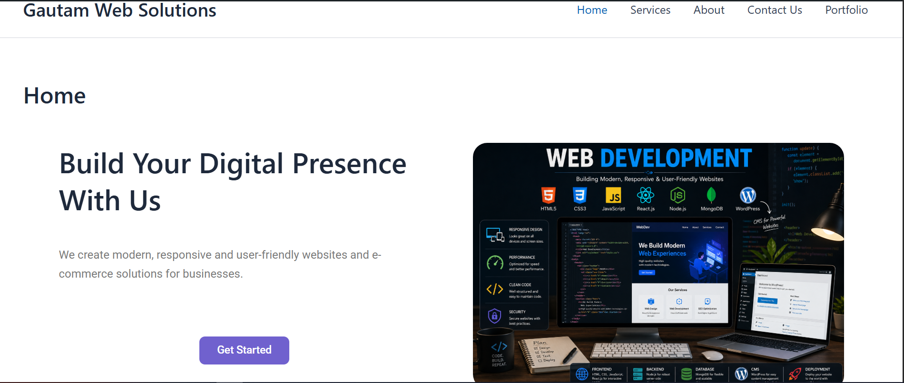
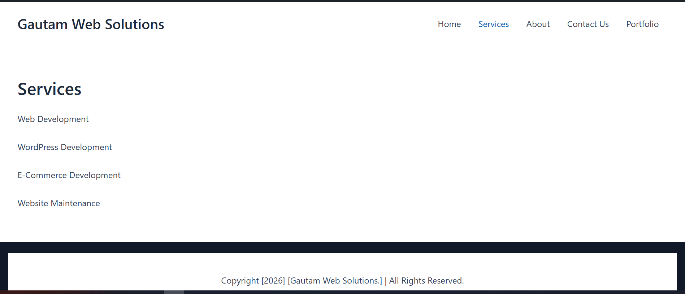
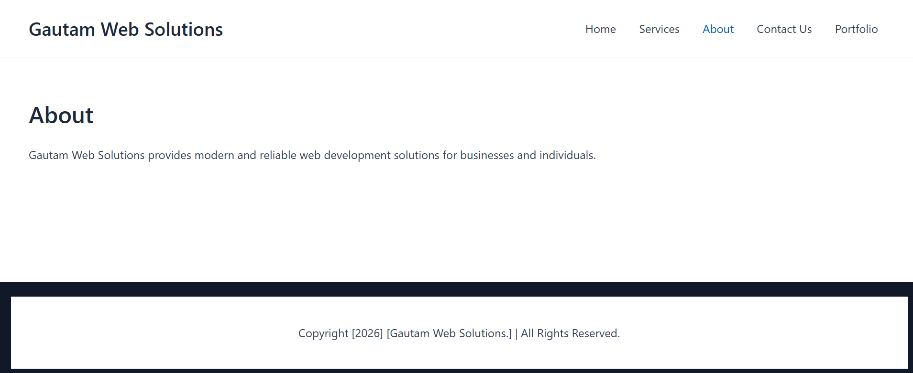
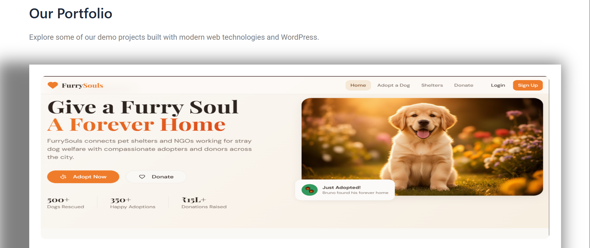
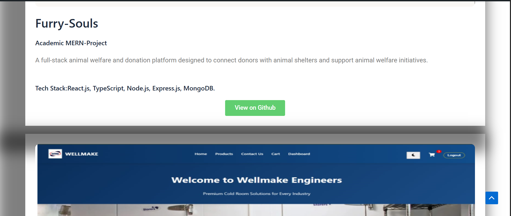
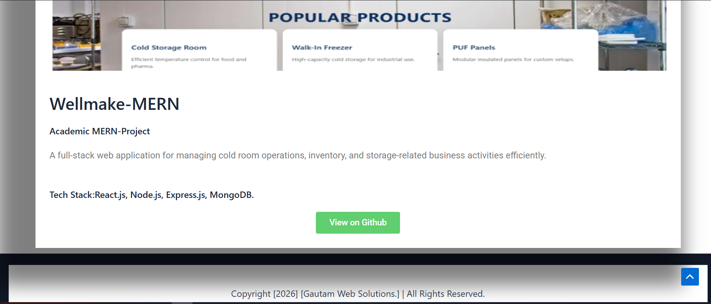
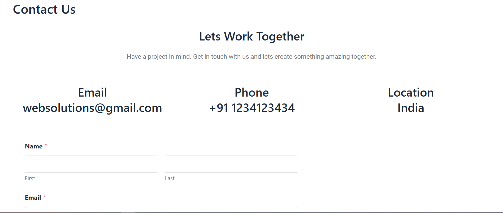

# Web Solutions

A professional and responsive business & portfolio website developed using WordPress.

## 📌 About the Project

Web Solutions is a responsive business website created to showcase web development services, portfolio projects, and contact information.

The project demonstrates practical experience in WordPress website development, page design, responsive layouts, navigation, forms, SEO configuration, and website customization.

## 🚀 Features

- Responsive design for desktop, tablet and mobile
- Home, About, Services, Contact and Portfolio pages
- Professional navigation and footer
- Portfolio showcase for MERN Stack projects
- GitHub integration for project repositories
- Contact form with email notifications
- Basic SEO configuration
- Customized layout, typography and spacing

## 🛠️ Technologies & Tools

- WordPress
- Elementor
- Astra Theme
- WPForms
- Rank Math SEO
- HTML
- CSS
- JavaScript

## 📂 Featured Projects

### FurrySouls
MERN Stack pet shelter and donation platform.

🔗 [GitHub Repository](https://github.com/GautamChauhan00/Furry-souls)

### WellMake-MERN
MERN Stack management application focused on cold-room operations, inventory and product management.

🔗 [GitHub Repository](https://github.com/GautamChauhan00/Wellmake-MERN)

## 📸 Screenshots

### 🏠 Home Page

### 🛠️ Services Page

### 👨‍💻 About Page

### 🚀 Portfolio

### 📩 Contact Us

## 👨‍💻 Developer

*Gautam Chauhan*

- GitHub: https://github.com/GautamChauhan00
